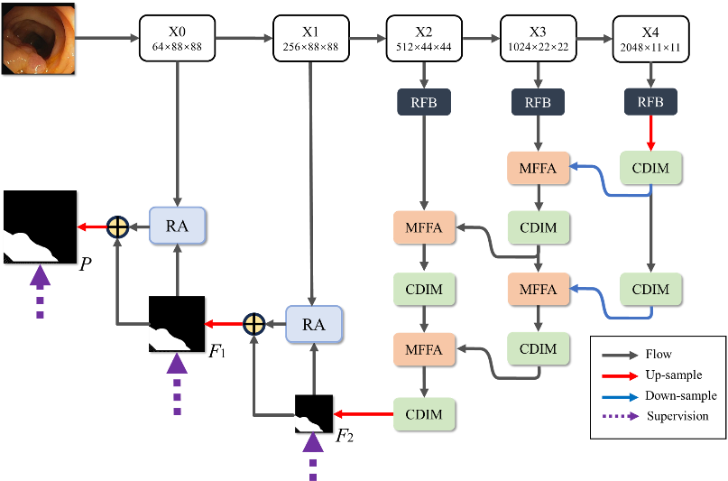
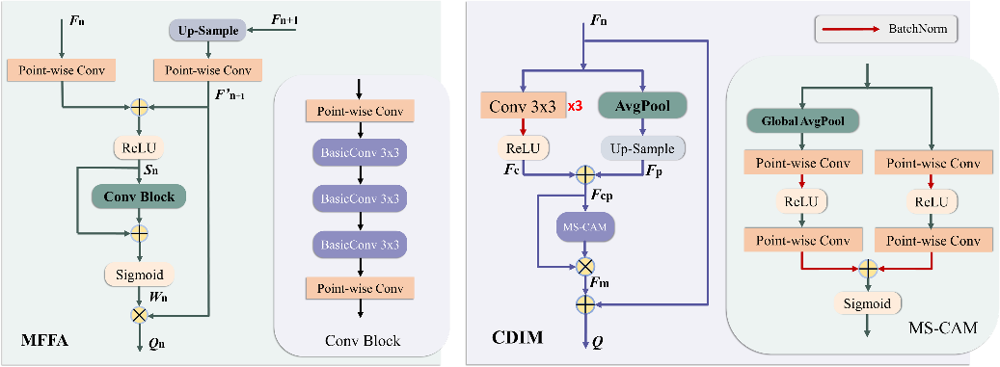
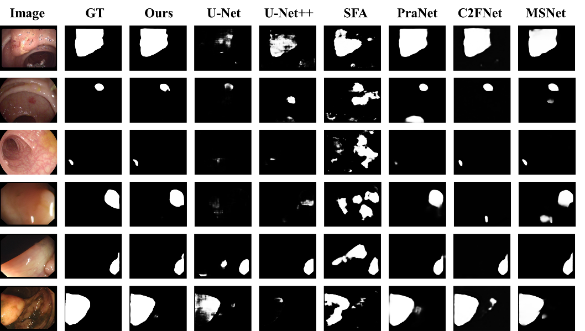

# LNPNet: Ladder Net for Polyp Segmentation with Multi-level Feature Fusion

## Methodology

We adopt Res2Net-50(Gao et al., 2021) as the network backbone to extract five fea-ture maps of different depths (X0-X4). Receptive Field Block (RFB)(Liu et al., 2018) was used to expand the receptive field and unify the number of channels for high-level feature maps (X2-X4). The feature maps processed by RFB enter the Mul-ti-level Feature Fusion Attention Gate (MFFA) and the Context Information and Deep Feature Integration Module (CDIM) arranged in ladders, respectively. MFFA is used to fuse the local level and higher level features and give different weights to pixels, so as to emphasize the target area and weaken the influence of irrelevant areas on the result, and output the attention-enhanced feature map. The input of CDIM is the feature map of each level, which is used to mine the global context semantic information of the feature map to realize the judgment of hidden targets of different sizes. Through the process of two steps as shown in Fig. 1, which generat-ing the segmentation result F2. The segmentation result F2 and the low-level feature map X1 with rich boundary features are fused through the reverse attention module (RA) to generate the segmentation result F1 with enhanced boundaries. The final result P is generated by fusing F1 and X0 with RA to improve the segmentation accuracy.





## Experiment

| Datasets                     | Methods        | mDice           | mIoU            | Fw              | Sa              | Emax            | MAE             |
| ---------------------------- | -------------- | --------------- | --------------- | --------------- | --------------- | --------------- | --------------- |
|                              | U-Net          | 0.823           | 0.755           | 0.811           | 0.889           | 0.954           | 0.019           |
|                              | U-Net++        | 0.794           | 0.729           | 0.785           | 0.873           | 0.931           | 0.022           |
|                              | SFA            | 0.700           | 0.607           | 0.647           | 0.793           | 0.885           | 0.042           |
| **CVC-ClinicDB**       | PraNet         | 0.899           | 0.849           | 0.896           | 0.936           | 0.979           | 0.009           |
|                              | C2F-Net        | **0.919** | **0.872** | 0.906           | 0.941           | 0.976           | 0.009           |
|                              | MSNet          | 0.918           | 0.869           | **0.913** | **0.946** | **0.979** | **0.008** |
|                              | **Ours** | **0.930** | **0.878** | **0.929** | **0.944** | **0.983** | **0.008** |
|                              | U-Net          | 0.818           | 0.746           | 0.794           | 0.858           | 0.893           | 0.055           |
|                              | U-Net++        | 0.821           | 0.743           | 0.808           | 0.862           | 0.910           | 0.048           |
|                              | SFA            | 0.723           | 0.611           | 0.670           | 0.782           | 0.849           | 0.075           |
| **Kvasir**             | PraNet         | 0.898           | 0.840           | 0.885           | 0.915           | 0.948           | 0.030           |
|                              | C2F-Net        | 0.886           | 0.831           | 0.870           | 0.905           | 0.935           | 0.036           |
|                              | MSNet          | **0.905** | **0.849** | **0.892** | **0.923** | **0.954** | 0.028           |
|                              | **Ours** | **0.903** | **0.848** | **0.891** | **0.914** | **0.951** | **0.027** |
|                              | U-Net          | 0.398           | 0.335           | 0.366           | 0.684           | 0.740           | 0.036           |
|                              | U-Net++        | 0.401           | 0.344           | 0.390           | 0.683           | 0.766           | 0.035           |
|                              | SFA            | 0.297           | 0.217           | 0.231           | 0.557           | 0.633           | 0.109           |
| **ETIS- LaribPolypDB** | PraNet         | 0.628           | 0.567           | 0.600           | 0.794           | 0.841           | 0.031           |
|                              | C2F-Net        | 0.699           | 0.624           | 0.668           | 0.827           | 0.875           | 0.022           |
|                              | MSNet          | **0.723** | **0.652** | **0.677** | **0.845** | **0.890** | **0.020** |
|                              | **Ours** | **0.751** | **0.662** | **0.707** | **0.848** | **0.898** | **0.017** |
|                              | U-Net          | 0.710           | 0.627           | 0.684           | 0.843           | 0.876           | 0.022           |
|                              | U-Net++        | 0.707           | 0.624           | 0.687           | 0.839           | 0.898           | 0.018           |
|                              | SFA            | 0.467           | 0.329           | 0.341           | 0.640           | 0.817           | 0.065           |
| **CVC-300**            | PraNet         | 0.871           | 0.797           | 0.843           | 0.925           | 0.972           | 0.010           |
|                              | C2F-Net        | **0.874** | **0.801** | 0.844           | **0.927** | **0.968** | **0.009** |
|                              | MSNet          | 0.865           | 0.799           | **0.848** | **0.926** | 0.953           | 0.010           |
|                              | **Ours** | **0.880** | **0.805** | **0.853** | 0.922           | **0.959** | **0.008** |
|                              | U-Net          | 0.512           | 0.444           | 0.498           | 0.712           | 0.776           | 0.061           |
|                              | U-Net++        | 0.483           | 0.410           | 0.467           | 0.691           | 0.760           | 0.064           |
|                              | SFA            | 0.469           | 0.347           | 0.379           | 0.634           | 0.765           | 0.094           |
| **CVC-ColonDB**        | PraNet         | 0.709           | 0.640           | 0.696           | 0.819           | 0.869           | 0.045           |
|                              | C2F-Net        | 0.724           | 0.650           | 0.705           | 0.826           | 0.868           | 0.044           |
|                              | MSNet          | **0.751** | **0.671** | **0.736** | **0.838** | **0.883** | **0.040** |
|                              | **Ours** | **0.736** | **0.657** | **0.722** | **0.826** | **0.860** | **0.041** |



If the work is useful for you, please cite us:

```
@misc{lnpnet,
    author={Chenhao Xu},
    title={LNPNet: Ladder Net for Polyp Segmentation with Multi-level Feature Fusion},
    howpublished={\url{https://github.com/XUCH1008/lnpnet}},
    year=2024,
}
```
